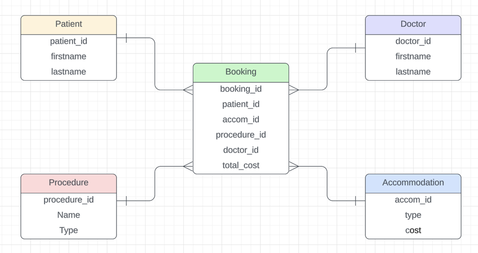

# MedLinked

MedLinked is a web application platform that provides users with the services of getting access to their foreign medical needs without any hassle. The users will get a chance to book their accommodation and place to stay and also get an insight on their booked medical procedures. This application brings together the field of medicine with travelling.

---

## Features

- CRUD Operations: There are 5 tables in this application and all of them have been provided with the major CRUD functions. The features to create, read, update and delete the entries for each entities have been added in the system.
- Tabular relationship: There exists a one to many relationship between the major tables to a bridging table calle 'Booking' that joins the major tables.
- ViewModels: In order to make the application more convenient and practical, the concept of viewModels have been used for efficient data sharing among the model classes.
- Views: The application has a neat and proper user interface for ease of use to the users.
- APIs: The application makes use of APIs to transfer and request data and render them to the respective views.

### ERD



---

## Technologies Used

- ASP.NET MVC Framework: The web application is developed using the ASP.NET MVC framework, providing a robust and scalable architecture for building dynamic web applications.
- C# Programming Language: C# is used for server-side scripting and backend logic, handling data processing and other server-side functionalities.
- Entity Framework & LINQ: Entity Framework and Language Integration Query are utilized for data access and management, providing seamless integration with the underlying database and simplifying CRUD operations.
- HTML/Bootstrap: Frontend development is done using HTML and Bootstrap, ensuring a visually appealing and interactive user interface.
- SQL Server Object Explorer: SQL SOE is used as the relational database management system for storing and managing application data efficiently.

---

## Installation

Follow these steps to install the project:

1. Step 1: Clone the repository
   ```bash
   git clone https://github.com/username/project.git

2. Step 2: Update the framework version
   Project > ZooApplication Properties > Change target framework to 4.7.1 -> Change back to 4.7.2
   
3. Step 3: Run the migrations
   ```bash
   enable migrations

4. Step 4: Add the migrations
   ```bash
   add-migration

5. Step 5: Update database
   ```bash
   update-database

6. Step 6: Run the application

---

## Time Sheet

### Day 1: March 11

- Created the project and the repo
- Tested the merge conflicts by running the projects on each member's devices
- The test was done on the application's background color
- Gained an understanding of merge conflicts and multiple commits from the team
- Created the models and migrations for the entities of the system

### Day 2: March 25

- Worked on the Controllers (WebAPI and MVC) for the entities
- Merged the codes and the changes
- Resolved some merge conflicts
- Worked on the homepage user interface

### Day 3: March 26

- Worked on the list function for bookings bridging entity
- Worked on the cards for the Homepage links
- List feature for Accommodation done

### Day 4: April 3

- Worked on the CRUD feature for Patients
- Worked on the CRUD feature for Doctors

### Day 5: April 5

- Fixed the delete feature for Doctor
- Worked on the CRUD for Accommodation and Medical Procedure
- Created a form for creating new bookings with data from other entities too

- ### Day 6: April 15

- Worked on the Related Bookings for Patients and other entities
- Fixed the styling for most of the pages
- Fixed the content display for each pages and the UI too
- Also worked on the bridging table Booking to display the details

---

## Contribution Guidelines

Contributions to the Travel Services Directory project are welcome! If you'd like to contribute, please fork the repository, make your changes, and submit a pull request. Be sure to follow the project's coding standards and guidelines.
